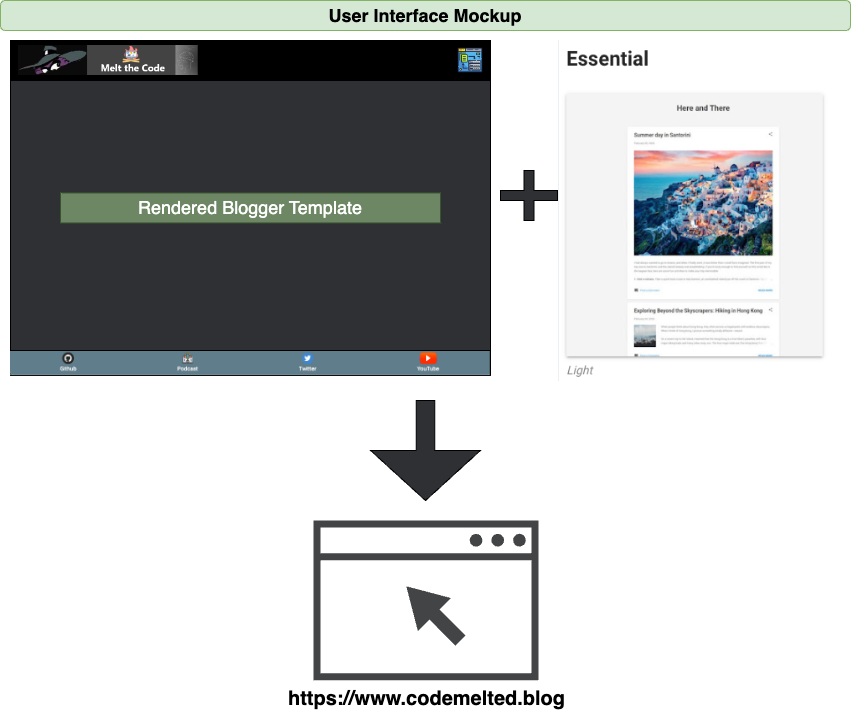

# Melt the Code - Blog

The following is the implementation notes for the [Melt the Code - Blog](https://codemelted.blog) domain.

**Table of Contents**

- [Melt the Code - Blog](#melt-the-code---blog)
  - [1.0 Description](#10-description)
  - [2.0 Design Notes](#20-design-notes)
    - [2.1 UI Mockup](#21-ui-mockup)
    - [2.2 The Hacked Theme (template.xml)](#22-the-hacked-theme-templatexml)
      - [2.2.1 HTML / CSS](#221-html--css)
      - [2.2.2 JavaScript](#222-javascript)
    - [2.3 Widgets](#23-widgets)
  - [3.0 Blog Maintenance](#30-blog-maintenance)
    - [3.1 Archiving Articles](#31-archiving-articles)
    - [3.2 Updating the Template](#32-updating-the-template)
    - [3.3 Widgets](#33-widgets)

## 1.0 Description

**WHO:** As a blog consumer

**WHAT:** I want a dedicated blog site

**WHY:** So that I may consume a blog that explores software engineer, STEM fields, amateur photography, the outdoors, and nerd culture while attempting to make sense of this world.

**ACCEPTANCE CRITERIA:**

1. Fixed header appears always unless the site is embedded.
2. When not embedded, the fixed header will
   1. Provide the melt the code logo as a return to home anchor
   2. Provide a web icon that will navigate to the https://codemelted.com domain
3. Navigation of the overall page will occur via a fixed bottom nav bar to access social media content.  When a tab is active, it will change its background color to signify it is the active content.
4. AC 1 - 3 will work with the chosen template in embedded or non-embedded modes
5. The following floating options will be provided regardless of what page or configuration the site is in
   1. Buy Me a Coffee - Providing people the ability to support my work
   2. Print - Ability to print via a popup window
   3. RSS Feed - An atom RSS feed for people to subscribe
6. The chosen template will implement the same background color and similar foreground schema as the other `codemelted.*` domains.

## 2.0 Design Notes

### 2.1 UI Mockup



*- NOTE: This represents the overall domain theme regardless of the chosen blog technology.*

### 2.2 The Hacked Theme (template.xml)

The chosen blogger template what the `Essential` theme.  It provided the desired layout.  Now in order to get the look you literally just need to hack the template.  The template was hacked and the sub-sections below added to get the desired look of the [UI Mockup](#ui-mockup).

#### 2.2.1 HTML / CSS

The following represents the custom header / footer applied to the chosen template with additional CSS to style to meet the [UI Mockup](#ui-mockup) definition.

```html
    <div class='cm-fixed-header' id='divFixedHeader'>
        
        <button id='btnWeb'></button>
    </div>

    <div class='cm-fixed-footer' id='divFixedFooter'>
        <button id='btnGithub'><br/>Github</button>
        <button id='btnPodcast'><br/>Podcast</button>
        <button id='btnTwitter'><br/>Twitter</button>
        <button id='btnYouTube'><br/>YouTube</button>
    </div>

    <style>
      /* width */
      ::-webkit-scrollbar {
        width: 5px;
        height: 3px;
      }
      /* Track */
      ::-webkit-scrollbar-track {
        background: darkslategray;
      }
      /* Handle */
      ::-webkit-scrollbar-thumb {
        background: #888;
      }
      /* Handle on hover */
      ::-webkit-scrollbar-thumb:hover {
        background: #555;
      }

      body {
        margin-top: 55px;
        margin-bottom: 55px;
      }

      /* Page Option Buttons */
      .cm-page-options {
        text-align: center;
        max-width: 50em;
        margin: auto;
        padding: 0.6250em;
      }
      .cm-page-options button {
        height: 30px;
        background-color: transparent;
        outline: none;
        border: none;
        cursor: pointer;
        font-size: 30px;
      }
      .cm-page-options img {
        height: 30px;
      }

      /* Header */
      .cm-fixed-header {
          display: grid;
          grid-template-columns: 1fr auto auto;
          border: 1px solid black;
          position: fixed;
          top: 0;
          left: 0;
          width: 100%;
          height: 55px;
          background-color: black;
          color: white;
          font-family: sans-serif;
          font-size: 12px;
          z-index: 2147483648;
      }
      .cm-fixed-header button {
          background-color: black;
          color: white;
          outline: none;
          border: none;
          cursor: pointer;
          font-size: 12px;
      }
      .cm-logo {
          display: block;
          height: 35px;
          margin-top: 12px;
          margin-left: 23px;
      }
      .cm-logo:hover {
          cursor: pointer;
      }

      /* Footer */
      .cm-fixed-footer {
          padding-top: 5px;
          padding-bottom: 5px;
          z-index: 2147483648;
          display: grid;
          grid-template-columns: auto auto auto auto;
          position: fixed;
          bottom: 0;
          left: 0;
          width: 100%;
          background-color: rgb(96, 125, 139);
          color: white;
          text-align: center;
          font-size: 12px;
      }

      .cm-fixed-footer button {
          background-color: rgb(96, 125, 139);
          color: white;
          outline: none;
          border: none;
          cursor: pointer;
          font-size: 12px;
      }

      .active, .cm-fixed-footer button:hover {
          font-weight: bold;
          color: black;
          background-color: rgb(189, 189, 189);
      }

      /* Blogger Overrides */
      .header-widget {
        text-align: center;
      }

      .Header h1, .Header h1 a, .Header h1 a:hover, .Header h1 a:visited, .Header p {
        color: white;
      }

      .page_body {
        background-color: #2F3033;
      }

      .cloud-label-widget-content {
        background-color: black;
      }

      .post-timestamp {
        color: #757575;
      }

      .post-author-label {
        color: #757575;
      }

      h1, h2, h3, h4, h5, h6 {
        color: #b5e853;
      }

      /* Handle nice printing on the page */
      @media print {
        .cm-fixed-footer {
          display: none;
        }
        .cm-page-options {
          display: none;
        }
        #Wikipedia1 {
          display: none;
        }
      }
    </style>
```

#### 2.2.2 JavaScript

The following is the custom JavaScript added to the bottom of the template after the [HTML / CSS](#html--css) templated code.

```javascript
    <script>
      const HOME_PAGE = &quot;https://www.codemelted.blog&quot;;
      const PORTAL_PAGE = &quot;https://codemelted.com&quot;;
      const URL_PAGE = {
        &quot;Github&quot;    : `${HOME_PAGE}/p/github.html`,
        &quot;Podcast&quot;   : `${HOME_PAGE}/p/podcast.html`,
        &quot;Twitter&quot;   : `${HOME_PAGE}/p/twitter.html`,
        &quot;YouTube&quot;   : `${HOME_PAGE}/p/youtube.html`,
      };

      /**
      * Determines if this is a mobile browser or not.
      * @returns true if mobile browser, false otherwise.
      */
      function isMobile() {
        return /Android|webOS|iPhone|iPad|iPod|BlackBerry|IEMobile|Opera Mini/i.
          test(navigator.userAgent);
      }

      /**
      * Opens a popup and sends a signal via query string to signal whether it
      * was opened via the main portal or not.
      * @param {string} url The url to open.
      * @param {string} windowName The title of the popup
      * @param {number} w The width of the popup
      * @param {number} h The height of the popup
      * @param {string} action An action to carry out for the popup window.
      */
      function popupWindow(url, windowName, w, h, action = undefined) {
        const top = (screen.height -  h) / 2;
        const left = (screen.width -  w) / 2;
        const goUrl = action !== undefined ? `${url}?action=${action}` : url;
        window.open(
          goUrl,
          windowName,
          `toolbar=no, location=no, directories=no, status=no, ` +
          `menubar=no, scrollbars=no, resizable=yes, copyhistory=no, ` +
          `width=${w}, height=${h}, top=${top}, left=${left}`
        );
      }

      // Parse our URLSearchParams to determine how we are configuring this
      // view.
      const queryString = window.location.search;
      const urlParams = new URLSearchParams(queryString);
      const isEmbedded = urlParams.has(&quot;isEmbedded&quot;)
        ? parseInt(urlParams.get(&quot;isEmbedded&quot;))
        : 0;

      const popupAction = urlParams.has(&quot;action&quot;)
          ? urlParams.get(&quot;action&quot;)
          : undefined;

      // Create the button actions to navigate to the appropriate page.
      // and set the if it is active or not depending on the page
      // navigated to.
      let href = window.location.href;
      for (const [key, value] of Object.entries(URL_PAGE)) {
          let btn = document.getElementById(`btn${key}`);

          // Assign the button action
          btn.addEventListener(&quot;click&quot;, () =&gt; {
              window.location.href = isEmbedded &gt; 0
                ? `${value}?isEmbedded=${isEmbedded}`
                : value;
          });

          // Determine and set the active tab if found
          if (href.toLowerCase().includes(key.toLowerCase())) {
              btn.style.backgroundColor = &quot;rgb(189, 189, 189)&quot;;
              btn.style.color = &quot;black&quot;;
              btn.style.fontWeight = &quot;bold&quot;;
              btn.classList.add(&quot;active&quot;);
          }
      }

      // Remove link away on author
      const collection = document.getElementsByClassName(&quot;g-profile&quot;);
      for (let x = 0; x &lt; collection.length; x++) {
        collection[x].href = &quot;#&quot;;
      }

      // Determine the path we are taking based on the query parameters
      if (popupAction) {
        // If is it print, go prep the document for print.
        // Anything else is simply a web popup from our main page.
        if (popupAction === &quot;print&quot;) {
          document.getElementById(&quot;divFixedHeader&quot;).style.display = &quot;none&quot;;
          document.body.style.marginTop = &quot;0px&quot;;
          document.getElementById(&quot;divFixedFooter&quot;).style.display = &quot;none&quot;;
          document.body.style.marginBottom = &quot;0px&quot;;
          document.getElementsByClassName(&quot;cm-page-options&quot;)[0].style.display = &quot;none&quot;;
          setTimeout(() =&gt; {
            window.print();
            if (!isMobile()) {
              window.close();
            }
          }, 750);
        }
      } else {
        // Hide some controls based on if we are embedded
        if (isEmbedded &gt; 0) {
            document.getElementById(&quot;divFixedHeader&quot;).style.display = &quot;none&quot;;
            document.getElementsByClassName(&quot;search&quot;)[0].style.display = &quot;none&quot;;
            var a = document.getElementsByTagName('a');
            for (var idx= 0; idx &lt; a.length; ++idx){
              let href = a[idx].href;
              a[idx].href = `${href}?isEmbedded=${isEmbedded}`;
            }
            document.body.style.marginTop = &quot;0px&quot;;
            if (isEmbedded === 2) {
              document.getElementById(&quot;divFixedFooter&quot;).style.display = &quot;none&quot;;
              document.body.style.marginBottom = &quot;0px&quot;;
            }
        }

        // Now assign our button actions, states from above will affect
        // how some of those action are performed.
        document.getElementById(&quot;imgLogo&quot;).addEventListener(&quot;click&quot;, () =&gt; {
            window.location.href = HOME_PAGE;
        });

        document.getElementById(&quot;btnWeb&quot;).addEventListener(&quot;click&quot;, () =&gt; {
            window.location.href = `${PORTAL_PAGE}`;
        });

        document.getElementById(&quot;btnSupport&quot;).addEventListener(&quot;click&quot;, () =&gt; {
          popupWindow(&quot;https://www.buymeacoffee.com/codemelted&quot;,
              &quot;Buy Me a Coffee&quot;, 900, 600);
        });

        document.getElementById(&quot;btnPrint&quot;).addEventListener(&quot;click&quot;, () =&gt; {
          popupWindow(href.split(&quot;?&quot;)[0], &quot;Melt the Code - Blog&quot;, 800, 500, &quot;print&quot;);
        });

        document.getElementById(&quot;btnRss&quot;).addEventListener(&quot;click&quot;, () =&gt; {
          popupWindow(&quot;https://www.codemelted.blog/feeds/posts/default&quot;, &quot;RSS Feed&quot;, 800, 500);
        });
      }
    </script>
```

### 2.3 Widgets

This contains the widgets from social media feeds that are pages in the blogger interface.  Here is a breakdown of the widgets:

- `podcast.html:` Anchor.fm embed code of the Melt the Code podcast
- `twitter.html:` The twitter provided embedded timeline
- `youtube.html:` Custom built feed of my youtube playlists.
- The GitHub page is handled via the [CodeMelted GitHub Repo](https://github.com/CodeMelted/CodeMelted) and is a copy and paste of that rendered page for blogger.

## 3.0 Blog Maintenance

### 3.1 Archiving Articles

Each month go and capture the articles for the [Melt the Code - Blog](https://www.codemelted.blog).

1. Navigate to the [Melt the Code - Blog](https://www.codemelted.blog)
2. Select the first article for the month being archived
3. Right-click and select `Save As`.  Save it to the `Download` folder.
4. Repeat step 3 for all articles for the month
5. Move the downloaded articles from the `Download` folder to the `blogger/articles/YYYY/MM` folder.  Create the `YYYY/MM` folder if it don't exist.

### 3.2 Updating the Template

1. Make any necessary changes to the template.xml
2. Navigate to [Blogger](https://www.blogger.com) to the blog
3. Select the `Theme` tab on the left hand side of the page
4. Select the drop down arrow of the `Customize` button and select `Restore`
5. Select the `template.xml` file to upload.  It should be successful
6. Navigate to the [Melt the Code - Blog](https://www.codemelted.blog) and ensure the desired affect.  Repeat steps 2 - 6 until completed
7. Commit the changes the `template.xml` to GitHub.

### 3.3 Widgets

You will need to do roughly the following if adding / updating a widget:
1. Capture the widget in the `blogger/widgets` folder
2. Navigate to [Blogger](https://www.blogger.com) to your blog
3. Select the `Pages` from the left hand tab
4. Select the page if of the widget if it already exists or select the `Create` button.
5. Copy the HTML code from the widget and paste it into the page.  Preview it to see if it looks the way you expect.
6. Select `Publish` or `Update` to publish the page to the blog

*NOTE: if this a new page, you will need to update the `divFixedFooter` and CSS code*